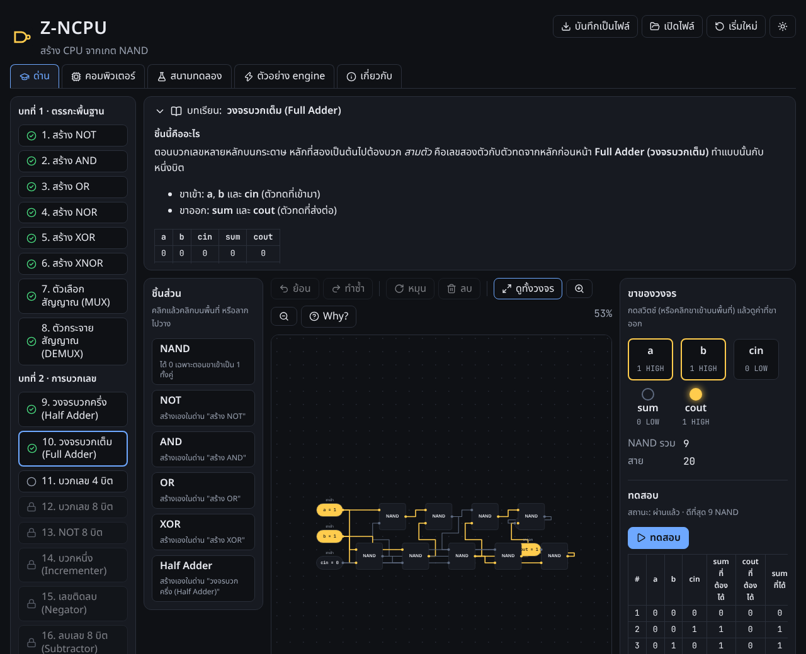
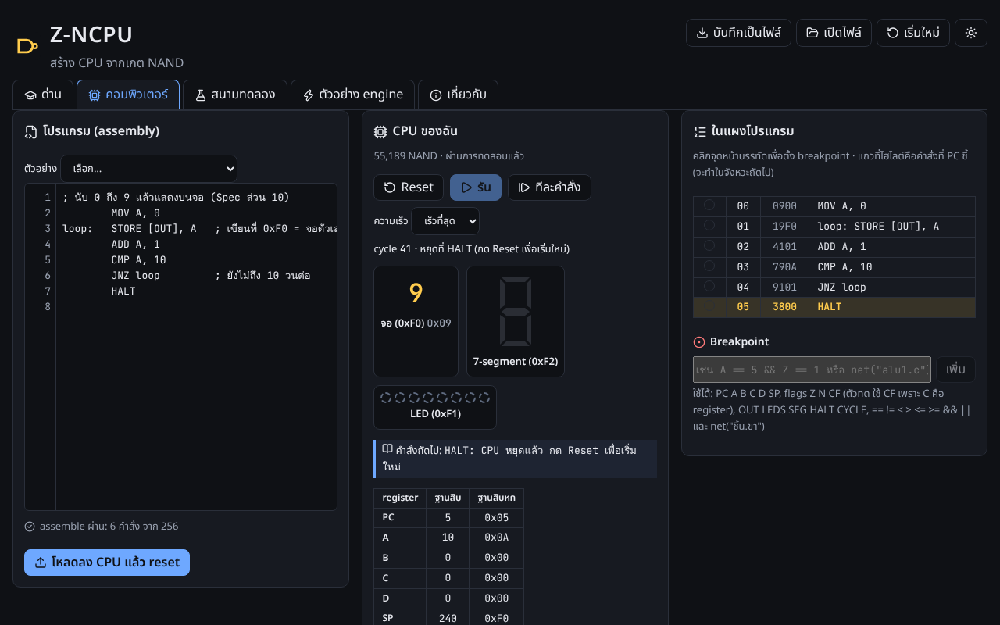
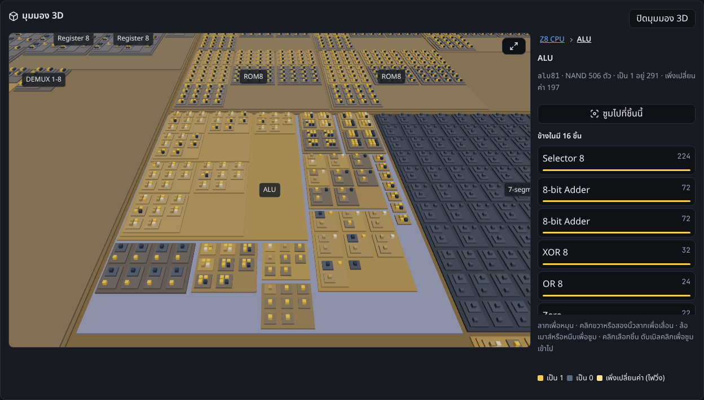
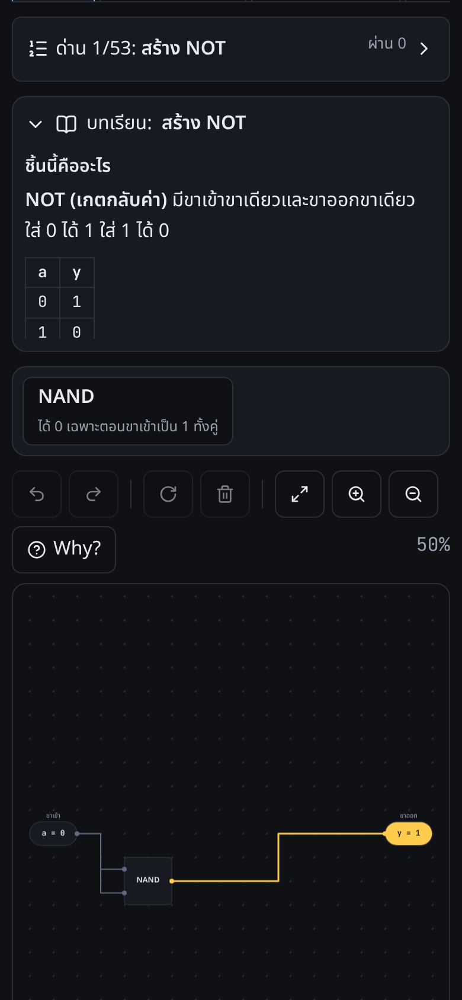

# Z-NCPU (Zero-NandCPU)

**สร้างคอมพิวเตอร์ 8 บิตด้วยมือตัวเอง เริ่มจากเกต NAND ตัวเดียว แล้วเขียนโปรแกรมให้ CPU ที่ต่อเองรันจริง**

เกมเรียนรู้ภาษาไทย เล่นบนเว็บ ติดตั้งเป็นแอป (PWA) ใช้ออฟไลน์ได้ และมีแอป Windows ผู้เล่นต่อวงจรทีละด่าน ตั้งแต่ NOT, AND, ตัวบวกเลข, ALU, หน่วยความจำ
จนได้ CPU Z8 ทั้งเครื่องที่ใช้ NAND 55,189 ตัว แล้วเขียน assembly ให้มันรัน พร้อมเครื่องมือดีบักระดับเกต และมุมมอง 3D ที่ซูมลงไปเห็น NAND ทุกตัว

> *English:* A Thai-language game where you build an 8-bit computer from a single NAND gate — logic gates, adders, an ALU, RAM, ROM, and finally a
> 55,189-NAND CPU that runs assembly programs you write. Every value on screen comes from simulating the player's own gates in a Web Worker.



| CPU ที่ต่อเองรันโปรแกรมนับ 0–9 | มุมมอง 3D: ซูมลงไปใน ALU เห็นไฟวิ่ง | บนมือถือ |
| --- | --- | --- |
|  |  |  |

## จุดเด่น

- **8 บท 53 ด่าน** พร้อมบทเรียนภาษาไทย คำใบ้ และการทดสอบอัตโนมัติทุกด่าน (ตารางความจริง ลำดับเวลา สุ่มเทียบฟังก์ชันอ้างอิง และรันโปรแกรมบน CPU)
- **จำลองระดับเกตจริง:** วงจรของผู้เล่นถูกแปลง (flatten) เป็น NAND ล้วน แล้วจำลองใน Web Worker มีสองโหมด
  - Visual Mode: event-driven ทีละ unit delay เห็นไฟวิ่งผ่านแต่ละเกต
  - Fast Mode: แบ่ง SCC แล้วเรียงตาม topological order วงจร 55,000 เกตรันได้หลายร้อยจังหวะนาฬิกาต่อวินาทีในเบราว์เซอร์
- **CPU Z8 ที่ผู้เล่นต่อเอง:** 8 บิต register A–D, Stack Pointer, flags Z C N, RAM 256 ไบต์, ROM 256 คำ และอุปกรณ์แบบ memory-mapped (จอตัวเลข, LED, 7-segment, สวิตช์, ปุ่ม, คีย์บอร์ด)
  ค่า register ที่เห็นอ่านมาจากขาของวงจรผู้เล่น ไม่ได้มาจาก emulator (emulator ใช้เป็นตัวเทียบตอนทดสอบเท่านั้น)
- **เครื่องมือดีบัก:** ย้อนเวลาได้ทุก cycle (keyframe + บันทึก input), Logic Analyzer, breakpoint แบบมีเงื่อนไข (parser ของตัวเอง ไม่ใช้ `eval`),
  X-Ray ดูข้างในชิ้นส่วนทุกชั้น และ **Why?** ที่ไล่ย้อนว่าค่าที่ขานี้มาจากเกตไหน
- **มุมมอง 3D:** three.js + React Three Fiber วาดแบบ instancing ลดรายละเอียดตามระยะซูม และระบายสีจากค่าของ NAND ทุกตัวในแต่ละเฟรม
- **ใช้ได้ทุกจอ:** เมาส์ คีย์บอร์ด และจอสัมผัส (สองนิ้วซูมพร้อมเลื่อน) ธีมมืด/สว่าง ใช้ได้กับโปรแกรมอ่านหน้าจอ
- **ความเป็นส่วนตัว:** ไม่ต้องสมัครสมาชิก ไม่เก็บข้อมูลการใช้งาน ความคืบหน้าอยู่ในเครื่อง ย้ายเครื่องด้วยไฟล์ `.zncpu`

## คุณภาพ

- เทสต์หน่วยและเทสต์รวม 460+ ตัว (Vitest) รวม Level CI ที่บังคับว่าเฉลยทุกด่านต้องผ่านทั้งสองโหมดการจำลอง
- E2E 110+ ตัว (Playwright) เปิดแอปจริงทั้งตอน dev และตัว build ต่อวงจรด้วยเมาส์และนิ้ว รันโปรแกรมบน CPU ทั้งเครื่อง
- TypeScript แบบ strict, ESLint บังคับกฎ dependency ระหว่าง package และห้าม `eval` / `new Function`
- ตอน build รวม license ของทุก dependency ไว้ใน `third-party-licenses.txt` และ build ไม่ผ่านถ้ามี license ที่ยังไม่ได้ตรวจ

## เริ่มใช้งาน

ต้องมี Node.js 20+ และ pnpm 10

```bash
pnpm install
pnpm dev          # เปิดเว็บที่ http://localhost:5173
pnpm check        # typecheck + lint + test (ชุดเดียวกับ CI)
pnpm build        # build เว็บไปที่ apps/web/dist
```

ทดสอบบนมือถือในวง Wi-Fi เดียวกัน: `pnpm --filter @z-ncpu/web exec vite --host` แล้วเปิดที่อยู่ในบรรทัด `Network:`

### E2E (Playwright)

```bash
pnpm e2e:install  # ครั้งแรกครั้งเดียว: ดาวน์โหลด Chromium สำหรับทดสอบ
pnpm e2e          # build แล้วรัน E2E ทั้งตอน dev (port 5174) และตัว build (port 4174)
```

ภาพหน้าจอใน README สร้างใหม่ได้ด้วย `SCREENSHOTS=1 pnpm exec playwright test e2e/screenshots.spec.ts --project=build`

### แอป Windows

ต้องติดตั้ง [Rust](https://rustup.rs) และ prerequisites ของ Tauri 2 (Microsoft C++ Build Tools + WebView2 ซึ่ง Windows 10/11 มีอยู่แล้ว)

```bash
pnpm desktop:dev    # เปิดแอปแบบ dev
pnpm desktop:build  # สร้างตัวติดตั้ง .exe (NSIS) ภาษาไทย/อังกฤษ
```

ตัวติดตั้งยังไม่มี code signing (ไม่มีค่าใช้จ่าย) Windows SmartScreen จึงจะเตือนตอนติดตั้งครั้งแรก

## สถาปัตยกรรม

```text
apps/
  web/        Vite + React 19: หน้าด่าน, หน้าคอมพิวเตอร์, มุมมอง 3D, PWA (build เดียวใช้ทั้งเว็บและ Windows)
  desktop/    Tauri 2 ห่อ build ของ web พร้อมตัวติดตั้ง NSIS ภาษาไทย
packages/
  shared/     types กลาง + protocol ระหว่าง UI กับ Web Worker
  engine/     circuit model, flatten → netlist NAND, Visual/Fast simulator, validator, time travel, Why? (TS ล้วน ไม่มี UI)
  isa/        ชุดคำสั่ง Z8: assembler, encode/decode, emulator สำหรับเทียบผล
  canvas/     editor (undo/redo), Canvas 2D renderer, การโต้ตอบเมาส์/นิ้ว/คีย์บอร์ด, ผังของมุมมอง 3D
  content/    ด่าน บทเรียน คำใบ้ glossary และเฉลยสำหรับ Level CI
```

- UI กับ engine คุยกันผ่าน message เท่านั้น engine อยู่ใน Web Worker หน้าจอจึงไม่ค้างแม้วงจรใหญ่
- React ไม่ render เกตทีละตัว: วงจร 2D วาดด้วย Canvas และ 3D วาดด้วย InstancedMesh
- หน้าที่ไม่ได้เปิดตอนเริ่ม (คอมพิวเตอร์, 3D, สนามทดลอง) แยกไฟล์และโหลดเมื่อกดเปิด

ตัวอย่างการใช้ engine โดยตรง:

```ts
import { circuit, ComponentLibrary, compile, createSimulator, inp, out } from '@z-ncpu/engine';

const b = circuit('user.not', 'NOT', [inp('a'), out('y')]);
const n = b.add('prim.nand');
b.wire('self.a', `${n}.a`).wire('self.a', `${n}.b`).wire(`${n}.y`, 'self.y');

const { netlist } = compile(new ComponentLibrary([b.build()]), 'user.not');
const sim = createSimulator(netlist!, 'fast');
sim.setInput('a', 1);
sim.settle();
sim.read('y'); // 0
```

## ผู้พัฒนา

**Pakornkiet Puanpanwong** · [github.com/PAKORNKIET](https://github.com/PAKORNKIET)

## License

[MIT](LICENSE) © 2026 Pakornkiet Puanpanwong

- ไลบรารีที่ติดไปกับแอป (React, three.js, React Three Fiber, lucide, workbox และอื่นๆ) ใช้ license เปิดทั้งหมด รายการเต็มอยู่ใน `third-party-licenses.txt` ของตัว build
- ฟอนต์ Noto Sans Thai และ JetBrains Mono ฝังมากับแอป ใช้ SIL Open Font License 1.1

## แรงบันดาลใจ

แนวคิด "สร้างคอมพิวเตอร์จาก NAND" ได้แรงบันดาลใจจาก [nand2tetris](https://www.nand2tetris.org) และ [NandGame](https://nandgame.com)
แต่ด่าน บทเรียน ชื่อชิ้นส่วน ชุดคำสั่ง Z8 และโค้ดทั้งหมดในโปรเจกต์นี้เขียนขึ้นใหม่ ไม่ได้นำเนื้อหา ไฟล์โจทย์ ไฟล์ทดสอบ หรือเฉลยของทั้งสองโปรเจกต์มาใช้
(เนื้อหาของ nand2tetris ใช้ [CC BY-NC-SA 3.0](https://www.nand2tetris.org/license) และผู้สร้างขอไม่ให้เผยแพร่เฉลยบนเว็บ)
